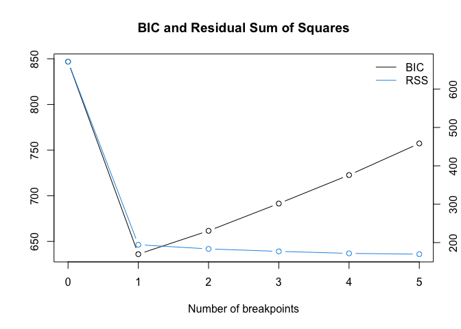

BenchmarkStudy
================
Tomoya Ozawa
2023-03-01

``` r
library(MASS)
library(tidyverse)
library(strucchange)
library(segmented)
```

## Simulated data

``` r
set.seed(123)
X_1 <- mvrnorm(n = 100, mu = rep(0, 5), Sigma = diag(5))
X_2 <- mvrnorm(n = 100, mu = rep(0, 5), Sigma = diag(5))
Beta_1 <- matrix(rep(1, 5), nrow = 5)
Beta_2 <- matrix(c(-1, 0, -1, 0, 1), nrow = 5)
epsilon_1 <- rnorm(100, 0, 1)
epsilon_2 <- rnorm(100, 0, 1)

Y_1 <- X_1%*%Beta_1 + epsilon_1
Y_2 <- X_2%*%Beta_2 + epsilon_2

Y <- rbind(Y_1, Y_2)
X <- rbind(X_1, X_2)
```

``` r
df_simulated <- cbind(Y, X) %>% 
  as.data.frame()

colnames(df_simulated) <- c("Y", "X1", "X2", "X3", "X4", "X5")

df_simulated %>% 
  head()
```

    ##            Y          X1         X2         X3          X4          X5
    ## 1 -0.8566688 -0.07355602 -0.7152422  2.1988103 -0.71040656 -0.56047565
    ## 2 -1.6221762 -1.16865142 -0.7526890  1.3124130  0.25688371 -0.23017749
    ## 3 -0.5443958 -0.63474826 -0.9385387 -0.2651451 -0.24669188  1.55870831
    ## 4 -0.9473701 -0.02884155 -1.0525133  0.5431941 -0.34754260  0.07050839
    ## 5 -3.5524771  0.67069597 -0.4371595 -0.4143399 -0.95161857  0.12928774
    ## 6  0.9149965 -1.65054654  0.3311792 -0.4762469 -0.04502772  1.71506499

``` r
df_simulated %>% 
  mutate(time = row_number()) %>% 
  ggplot(mapping = aes(x = time, y = Y)) +
  geom_line()
```

<!-- -->

## Benchmark Methods:

### Bai and Perron (2003)

- `breakpoints()` from
  [strucchange](https://cran.r-project.org/web/packages/strucchange/strucchange.pdf)

``` r
result_Bai_Perron <- breakpoints(Y ~ X1 + X2 + X3 + X4 + X5, data = df_simulated)
result_Bai_Perron
```

    ## 
    ##   Optimal 2-segment partition: 
    ## 
    ## Call:
    ## breakpoints.formula(formula = Y ~ X1 + X2 + X3 + X4 + X5, data = df_simulated)
    ## 
    ## Breakpoints at observation number:
    ## 100 
    ## 
    ## Corresponding to breakdates:
    ## 0.5

- BIC is used as criteria to choose the number of change points

``` r
result_Bai_Perron %>% plot()
```

<!-- -->

### Muggeo (2003)

- `segmented()` from
  [segmented](https://cran.r-project.org/web/packages/segmented/segmented.pdfted)

- It seems to be different from what we will do in our research. detect
  not change point in y but change point in the relation ship between y
  and covariates.

``` r
model_lm <- lm(Y ~ X1 + X2 + X3 + X4 + X5, data = df_simulated)
segmented(model_lm, seg.Z =  ~ X1 + X2 + X3 + X4 + X5)
```

    ## Call: segmented.lm(obj = model_lm, seg.Z = ~X1 + X2 + X3 + X4 + X5)
    ## 
    ## Meaningful coefficients of the linear terms:
    ## (Intercept)           X1           X2           X3           X4           X5  
    ##     -0.9890      -0.3680       1.5449      -2.5012       0.7590       1.5728  
    ##       U1.X1        U1.X2        U1.X3        U1.X4        U1.X5  
    ##      0.4442      -1.1461       2.4938      -0.4394      -0.7934  
    ## 
    ## Estimated Break-Point(s):
    ## psi1.X1  psi1.X2  psi1.X3  psi1.X4  psi1.X5  
    ## -0.3177  -0.8916  -1.3267  -0.2155  -1.4566
