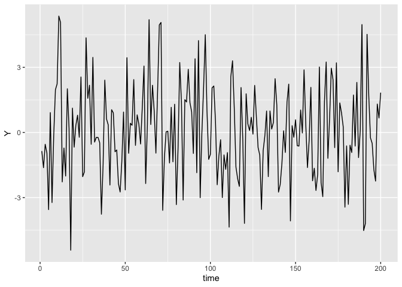
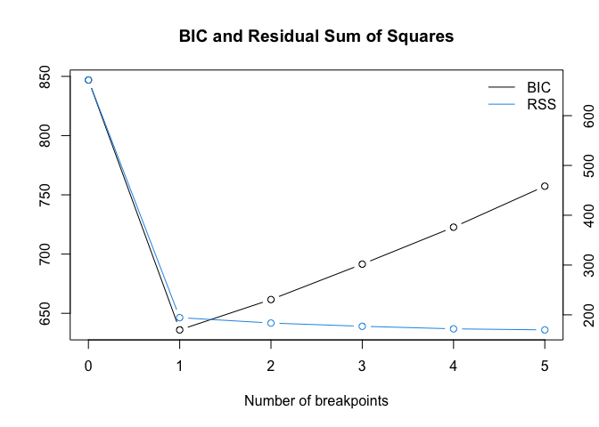

BenchmarkStudy
================
Tomoya Ozawa
2023-03-01

``` r
library(MASS)
library(tidyverse)
library(strucchange)
library(segmented)
```

## Simulated data

``` r
set.seed(123)
X_const <- matrix(rep(1, 100), nrow = 100)
X_1 <- mvrnorm(n = 100, mu = rep(0, 5), Sigma = diag(5))
X_2 <- mvrnorm(n = 100, mu = rep(0, 5), Sigma = diag(5))

X_1 <- cbind(X_const, X_1)
X_2 <- cbind(X_const, X_2)

Beta_1 <- matrix(rep(1, 6), nrow = 6)
Beta_2 <- matrix(c(1, -1, 0, -1, 0, 1), nrow = 6)
epsilon_1 <- rnorm(100, 0, 1)
epsilon_2 <- rnorm(100, 0, 1)

Y_1 <- X_1%*%Beta_1 + epsilon_1
Y_2 <- X_2%*%Beta_2 + epsilon_2

Y <- rbind(Y_1, Y_2)
X <- rbind(X_1, X_2)
```

``` r
df_simulated <- cbind(Y, X) %>% 
  as.data.frame()

colnames(df_simulated) <- c("Y", "const", "X1", "X2", "X3", "X4", "X5")

df_simulated %>% 
  head()
```

    ##             Y const          X1         X2         X3          X4          X5
    ## 1  0.14333121     1 -0.07355602 -0.7152422  2.1988103 -0.71040656 -0.56047565
    ## 2 -0.62217624     1 -1.16865142 -0.7526890  1.3124130  0.25688371 -0.23017749
    ## 3  0.45560417     1 -0.63474826 -0.9385387 -0.2651451 -0.24669188  1.55870831
    ## 4  0.05262989     1 -0.02884155 -1.0525133  0.5431941 -0.34754260  0.07050839
    ## 5 -2.55247712     1  0.67069597 -0.4371595 -0.4143399 -0.95161857  0.12928774
    ## 6  1.91499645     1 -1.65054654  0.3311792 -0.4762469 -0.04502772  1.71506499

``` r
df_simulated %>% 
  mutate(time = row_number()) %>% 
  ggplot(mapping = aes(x = time, y = Y)) +
  geom_line()
```

<!-- -->

## Benchmark Methods:

### Bai and Perron (2003)

- `breakpoints()` from
  [strucchange](https://cran.r-project.org/web/packages/strucchange/strucchange.pdf)

``` r
result_Bai_Perron <- breakpoints(Y ~ X1 + X2 + X3 + X4 + X5, data = df_simulated)
result_Bai_Perron
```

    ## 
    ##   Optimal 2-segment partition: 
    ## 
    ## Call:
    ## breakpoints.formula(formula = Y ~ X1 + X2 + X3 + X4 + X5, data = df_simulated)
    ## 
    ## Breakpoints at observation number:
    ## 100 
    ## 
    ## Corresponding to breakdates:
    ## 0.5

``` r
summary(result_Bai_Perron)
```

    ## 
    ##   Optimal (m+1)-segment partition: 
    ## 
    ## Call:
    ## breakpoints.formula(formula = Y ~ X1 + X2 + X3 + X4 + X5, data = df_simulated)
    ## 
    ## Breakpoints at observation number:
    ##                          
    ## m = 1         100        
    ## m = 2   42    100        
    ## m = 3   42    100     166
    ## m = 4   42    97  127 159
    ## m = 5   40 70 100 139 169
    ## 
    ## Corresponding to breakdates:
    ##                                    
    ## m = 1             0.5              
    ## m = 2   0.21      0.5              
    ## m = 3   0.21      0.5         0.83 
    ## m = 4   0.21      0.485 0.635 0.795
    ## m = 5   0.2  0.35 0.5   0.695 0.845
    ## 
    ## Fit:
    ##                                        
    ## m   0     1     2     3     4     5    
    ## RSS 671.5 194.3 183.5 177.0 171.9 169.7
    ## BIC 846.9 636.0 661.6 691.5 722.7 757.3

- BIC is used as criteria to choose the number of change points

``` r
result_Bai_Perron %>% plot()
```

<!-- -->

### Muggeo (2003)

- `segmented()` from
  [segmented](https://cran.r-project.org/web/packages/segmented/segmented.pdfted)

- I am not sure what `seg.Z` means. Document says `seg.Z` is the
  segmented variable, i.e. the continuous covariates understood to have
  a piecewise-linear relationship will be estimated

``` r
df_simulated <- mutate(df_simulated,
                       time = row_number())
model_lm <- lm(Y ~ X1 + X2 + X3 + X4 + X5, data = df_simulated)
segmented(model_lm, seg.Z =  ~ time)
```

    ## Call: segmented.lm(obj = model_lm, seg.Z = ~time)
    ## 
    ## Meaningful coefficients of the linear terms:
    ## (Intercept)           X1           X2           X3           X4           X5  
    ##    1.249381    -0.126393     0.603808    -0.196111     0.549034     0.818364  
    ##     U1.time  
    ##   -0.003353  
    ## 
    ## Estimated Break-Point(s):
    ## psi1.time  
    ##        83

``` r
df_simulated <- mutate(df_simulated,
                       time = row_number())
model_lm <- lm(Y ~ X1 + X2 + X3 + X4 + X5, data = df_simulated)
segmented(model_lm, seg.Z =   ~ X1 + X2 + X3 + X4 + X5)
```

    ## Call: segmented.lm(obj = model_lm, seg.Z = ~X1 + X2 + X3 + X4 + X5)
    ## 
    ## Meaningful coefficients of the linear terms:
    ## (Intercept)           X1           X2           X3           X4           X5  
    ##     0.01096     -0.36798      1.54494     -2.50118      0.75899      1.57281  
    ##       U1.X1        U1.X2        U1.X3        U1.X4        U1.X5  
    ##     0.44417     -1.14610      2.49375     -0.43945     -0.79337  
    ## 
    ## Estimated Break-Point(s):
    ## psi1.X1  psi1.X2  psi1.X3  psi1.X4  psi1.X5  
    ## -0.3177  -0.8916  -1.3267  -0.2155  -1.4566
