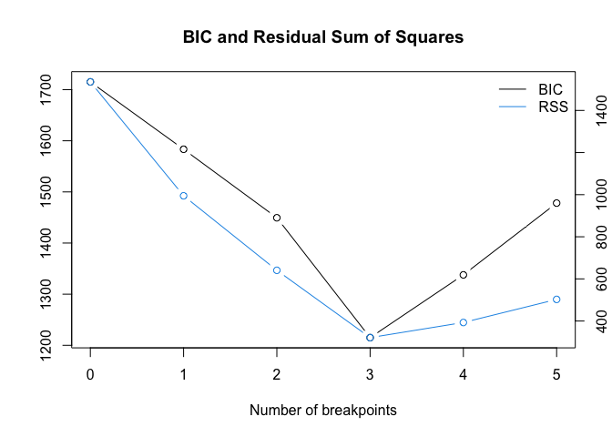

BenchmarkStudy
================
Tomoya Ozawa
2023-04-01

``` r
library(MASS)
library(tidyverse)
library(strucchange)
library(segmented)
library(bcp)
```

## Simulated data: One change Point

``` r
set.seed(123)
X_const <- matrix(rep(1, 100), nrow = 100)
X_1 <- mvrnorm(n = 100, mu = rep(0, 5), Sigma = diag(5))
X_2 <- mvrnorm(n = 100, mu = rep(0, 5), Sigma = diag(5))

X_1 <- cbind(X_const, X_1)
X_2 <- cbind(X_const, X_2)

Beta_1 <- matrix(rep(1, 6), nrow = 6)
Beta_2 <- matrix(c(1, -1, 0, -1, 0, 1), nrow = 6)
epsilon_1 <- rnorm(100, 0, 1)
epsilon_2 <- rnorm(100, 0, 1)

Y_1 <- X_1%*%Beta_1 + epsilon_1
Y_2 <- X_2%*%Beta_2 + epsilon_2

Y <- rbind(Y_1, Y_2)
X <- rbind(X_1, X_2)
```

``` r
df_simulated <- cbind(Y, X) %>% 
  as.data.frame()

colnames(df_simulated) <- c("Y", "const", "X1", "X2", "X3", "X4", "X5")

df_simulated %>% 
  head()
```

    ##             Y const          X1         X2         X3          X4          X5
    ## 1  0.14333121     1 -0.07355602 -0.7152422  2.1988103 -0.71040656 -0.56047565
    ## 2 -0.62217624     1 -1.16865142 -0.7526890  1.3124130  0.25688371 -0.23017749
    ## 3  0.45560417     1 -0.63474826 -0.9385387 -0.2651451 -0.24669188  1.55870831
    ## 4  0.05262989     1 -0.02884155 -1.0525133  0.5431941 -0.34754260  0.07050839
    ## 5 -2.55247712     1  0.67069597 -0.4371595 -0.4143399 -0.95161857  0.12928774
    ## 6  1.91499645     1 -1.65054654  0.3311792 -0.4762469 -0.04502772  1.71506499

``` r
df_simulated %>% 
  write.csv("simulation_data_R.csv", row.names = FALSE)
```

``` r
df_simulated %>% 
  mutate(time = row_number()) %>% 
  ggplot(mapping = aes(x = time, y = Y)) +
  geom_line()
```

<!-- -->

## Benchmark Methods:

### Bai and Perron (2003)

- `breakpoints()` from
  [strucchange](https://cran.r-project.org/web/packages/strucchange/strucchange.pdf)
  - `breaks =`: maximal number of change points for detecting
  - `h =`: minimal segment size either given as fraction relative to the
    sample size or as an integer giving the minimal number of
    observations in each segment.

``` r
result_Bai_Perron <- breakpoints(Y ~ X1 + X2 + X3 + X4 + X5, data = df_simulated, breaks = 5, h = 0.15)
result_Bai_Perron
```

    ## 
    ##   Optimal 2-segment partition: 
    ## 
    ## Call:
    ## breakpoints.formula(formula = Y ~ X1 + X2 + X3 + X4 + X5, h = 0.15, 
    ##     breaks = 5, data = df_simulated)
    ## 
    ## Breakpoints at observation number:
    ## 100 
    ## 
    ## Corresponding to breakdates:
    ## 0.5

``` r
summary(result_Bai_Perron)
```

    ## 
    ##   Optimal (m+1)-segment partition: 
    ## 
    ## Call:
    ## breakpoints.formula(formula = Y ~ X1 + X2 + X3 + X4 + X5, h = 0.15, 
    ##     breaks = 5, data = df_simulated)
    ## 
    ## Breakpoints at observation number:
    ##                          
    ## m = 1         100        
    ## m = 2   42    100        
    ## m = 3   42    100     166
    ## m = 4   42    97  127 159
    ## m = 5   40 70 100 139 169
    ## 
    ## Corresponding to breakdates:
    ##                                    
    ## m = 1             0.5              
    ## m = 2   0.21      0.5              
    ## m = 3   0.21      0.5         0.83 
    ## m = 4   0.21      0.485 0.635 0.795
    ## m = 5   0.2  0.35 0.5   0.695 0.845
    ## 
    ## Fit:
    ##                                        
    ## m   0     1     2     3     4     5    
    ## RSS 671.5 194.3 183.5 177.0 171.9 169.7
    ## BIC 846.9 636.0 661.6 691.5 722.7 757.3

- BIC is used as criteria to choose the number of change points

``` r
result_Bai_Perron %>% plot()
```

<!-- -->

### Wang and Emerson (2015); Barry and Hartigan (1993): Bayesian approach

- `bcp()` from
  [bcp](https://cran.r-project.org/web/packages/bcp/bcp.pdf) package

``` r
result_bcp <- bcp(y = Y, x = X)
plot(result_bcp)
```

<!-- -->

<!-- ### Muggeo (2003) -->
<!-- - `segmented()` from [segmented](https://cran.r-project.org/web/packages/segmented/segmented.pdfted) -->
<!-- - I am not sure what `seg.Z` means. Document says `seg.Z` is the segmented variable, i.e. the continuous covariates understood to have a piecewise-linear relationship will be estimated -->

``` r
# model_lm <- lm(Y ~ 1, data = df_simulated)
# segmented(model_lm, seg.Z =  ~ X1 + X2 + X3 + X4 + X5) %>% plot(term = X1)
```

``` r
# df_simulated <- mutate(df_simulated,
#                        time = row_number())
# model_lm <- lm(Y ~ X1 + X2 + X3 + X4 + X5, data = df_simulated)
# segmented(model_lm, seg.Z =  ~ time) %>% plot()
```

``` r
# df_simulated <- mutate(df_simulated,
#                        time = row_number())
# model_lm <- lm(Y ~ time, data = df_simulated)
# segmented(model_lm, seg.Z = ~ X1 + X2 + X3 + X4 + X5) %>% summary()
```

``` r
# model_lm <- lm(Y ~ X1 + X2 + X3 + X4 + X5, data = df_simulated)
# segmented(model_lm, seg.Z =   ~ X1 + X2 + X3 + X4 + X5) %>% plot(term = "X1")
```

## Simulated data: multiple (3) change points

``` r
set.seed(123)
X_const <- matrix(rep(1, 100), nrow = 100)
X_1 <- mvrnorm(n = 100, mu = rep(0, 5), Sigma = diag(5))
X_2 <- mvrnorm(n = 100, mu = rep(0, 5), Sigma = diag(5))
X_3 <- mvrnorm(n = 100, mu = rep(0, 5), Sigma = diag(5))
X_4 <- mvrnorm(n = 100, mu = rep(0, 5), Sigma = diag(5))

X_1 <- cbind(X_const, X_1)
X_2 <- cbind(X_const, X_2)
X_3 <- cbind(X_const, X_3)
X_4 <- cbind(X_const, X_4)

Beta_1 <- matrix(rep(1, 6), nrow = 6)
Beta_2 <- matrix(c(1, -1, 0, -1, 0, 1), nrow = 6)
Beta_3 <- matrix(c(1, 0, 1, 1, 0, -1), nrow = 6)
Beta_4 <- matrix(c(1, 1, 0, -1, -1, 1), nrow = 6)

epsilon_1 <- rnorm(100, 0, 1)
epsilon_2 <- rnorm(100, 0, 1)
epsilon_3 <- rnorm(100, 0, 1)
epsilon_4 <- rnorm(100, 0, 1)

Y_1 <- X_1%*%Beta_1 + epsilon_1
Y_2 <- X_2%*%Beta_2 + epsilon_2
Y_3 <- X_3%*%Beta_3 + epsilon_3
Y_4 <- X_4%*%Beta_4 + epsilon_4

Y_multi <- rbind(Y_1, Y_2, Y_3, Y_4)
X_multi <- rbind(X_1, X_2, X_3, X_4)
```

``` r
df_simulated_multi <- cbind(Y_multi, X_multi) %>% 
  as.data.frame()

colnames(df_simulated_multi) <- c("Y", "const", "X1", "X2", "X3", "X4", "X5")

df_simulated_multi %>% 
  head()
```

    ##             Y const          X1         X2         X3          X4          X5
    ## 1  0.62752621     1 -0.07355602 -0.7152422  2.1988103 -0.71040656 -0.56047565
    ## 2  0.65471668     1 -1.16865142 -0.7526890  1.3124130  0.25688371 -0.23017749
    ## 3 -0.06800476     1 -0.63474826 -0.9385387 -0.2651451 -0.24669188  1.55870831
    ## 4  1.40403267     1 -0.02884155 -1.0525133  0.5431941 -0.34754260  0.07050839
    ## 5  0.17100153     1  0.67069597 -0.4371595 -0.4143399 -0.95161857  0.12928774
    ## 6  0.25915468     1 -1.65054654  0.3311792 -0.4762469 -0.04502772  1.71506499

## Benchmark Methods:

### Bai and Perron (2003)

``` r
result_Bai_Perron_multi <- breakpoints(Y ~ X1 + X2 + X3 + X4 + X5, data = df_simulated_multi)
result_Bai_Perron_multi
```

    ## 
    ##   Optimal 4-segment partition: 
    ## 
    ## Call:
    ## breakpoints.formula(formula = Y ~ X1 + X2 + X3 + X4 + X5, data = df_simulated_multi)
    ## 
    ## Breakpoints at observation number:
    ## 100 200 300 
    ## 
    ## Corresponding to breakdates:
    ## 0.25 0.5 0.75

``` r
summary(result_Bai_Perron_multi)
```

    ## 
    ##   Optimal (m+1)-segment partition: 
    ## 
    ## Call:
    ## breakpoints.formula(formula = Y ~ X1 + X2 + X3 + X4 + X5, data = df_simulated_multi)
    ## 
    ## Breakpoints at observation number:
    ##                            
    ## m = 1                   300
    ## m = 2   97              300
    ## m = 3   100     200     300
    ## m = 4   84  144 204     300
    ## m = 5   71  131 191 251 311
    ## 
    ## Corresponding to breakdates:
    ##                                           
    ## m = 1                               0.75  
    ## m = 2   0.2425                      0.75  
    ## m = 3   0.25          0.5           0.75  
    ## m = 4   0.21   0.36   0.51          0.75  
    ## m = 5   0.1775 0.3275 0.4775 0.6275 0.7775
    ## 
    ## Fit:
    ##                                              
    ## m   0      1      2      3      4      5     
    ## RSS 1535.5  994.7  640.7  321.1  393.0  502.6
    ## BIC 1715.1 1583.4 1449.4 1215.0 1337.8 1478.1

``` r
result_Bai_Perron_multi %>% plot()
```

<!-- -->

### Wang and Emerson (2015); Barry and Hartigan (1993): Bayesian approach

``` r
result_bcp_multi <- bcp(y = Y_multi, x = X_multi)
plot(result_bcp_multi)
```

<!-- -->
